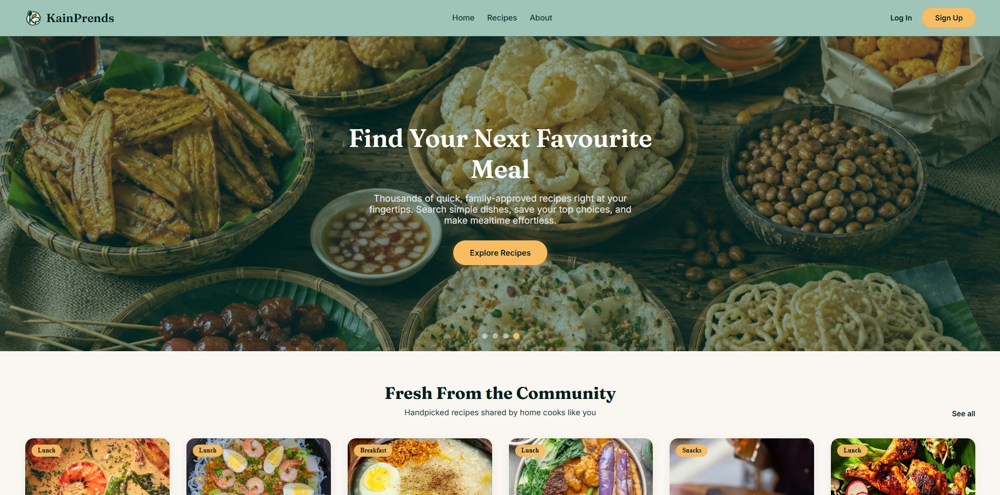

# 🍽️ KainPrends

A modern recipe discovery web application built with React, TypeScript,
Vite, and Supabase.

## 🍴 About the Name

**KainPrends** combines *kain* (Filipino for "eat") with *prends*, a playful name I use for friends that evolved from the commonly used Filipino nickname *pre*.

🌐 **Live Demo:** [kainprends.vercel.app](https://kainprends.vercel.app)

## ✨ Features
- Search recipes by title and ingredients
- Multi-category filtering and sorting
- Detailed recipe pages
- User authentication and password recovery
- Save and manage favorite recipes
- Responsive desktop, tablet, and mobile design
- Supabase database with Row Level Security

## 🛠️ Tech Stack

**Frontend:** React, TypeScript, Vite, React Router  
**Backend:** Supabase (PostgreSQL, Auth, RLS)  
**Deployment:** Vercel  
**Version Control:** Git & GitHub

## ⚠️ Portfolio Demo

KainPrends is a portfolio demonstration project.

Email confirmation is intentionally disabled and OAuth/social login is
not implemented to make it easier for reviewers to create an account
and explore the application's authenticated features.

These choices are specific to the portfolio demo and do not represent
the authentication configuration I would use for a production application.